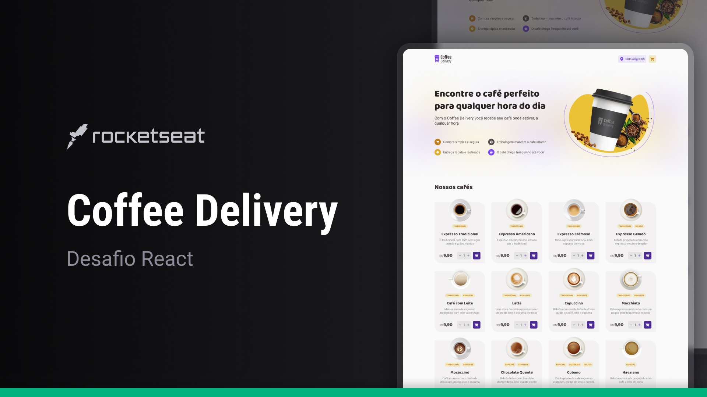

# Coffee Delivery

Project developed in Rocketseat's React.js training of a SPA (Single Page Application) built with React.js with Typescript of a frontend for a Coffee Delivery.

You can see the result <a href="https://foodexplorer.vrd.ppg.br/" target="_blank">here.</a>

  <a href="#-tecnologias">Technologies</a>&nbsp;&nbsp;&nbsp;|&nbsp;&nbsp;&nbsp;
  <a href="#-projeto">Project</a>&nbsp;&nbsp;&nbsp;|&nbsp;&nbsp;&nbsp;
  <a href="#-layout">Layout</a>&nbsp;&nbsp;&nbsp;|&nbsp;&nbsp;&nbsp;
  <a href="#memo-licença">License</a>

  

 

  

## Technologies

This project was developed with the following technologies:

- Figma
- HTML e CSS
- React.js
- Typescript
- Javascript
- Git e Github

## Project

A frontend for a coffee delivery, created in React.js using Typescript and some libraries. Concepts such as useState, useEffect, useReducer, typing, context, react form hook, and application routes were covered.

This is a project done in a module of the React.js training course at Rockeseat.

## Layout

You can view the project layout through [THIS LINK](https://www.figma.com/file/5yT9ZzZmRQRS4yivGGB3pl/Coffee-Delivery/duplicate). It's necessary to have an account on [Figma](https://figma.com) to access it.

## License

This project is under the MIT license.

---

Made with ♥ by [rafaverde](https://github.com/rafaverde) :wave:

RocketSeat Student - [Participe da nossa comunidade!](https://discord.gg/rocketseat)

#coffeeDelivery #RocketSeat #react #typescript #html #css #javascript
